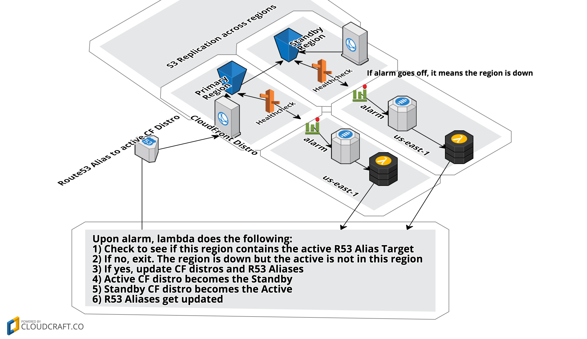

# https://static-site.jolexa.us/
=======

## Motivation
On [Feburary 28th](https://aws.amazon.com/message/41926/), AWS S3
in us-east-1, was
[down](https://techcrunch.com/2017/02/28/amazon-aws-s3-outage-is-breaking-things-for-a-lot-of-websites-and-apps/)
for several
[hours](https://techcrunch.com/2017/03/02/aws-cloudsplains-what-happend-to-s3-storage-on-monday/).
Many people, myself included, host static site on S3. Static sites backed by AWS
S3 are great because they actually don't require servers to host a website
(#serverless, :D). However, this event broke many SLAs for customers and was a
general annoyance or even embarrassing. It is true that other regions were not
effected too much but `us-east-1` is the most popular region and probably the
biggest.

I don't want my personal sites to go down in this event. Companies don't want
their assets to be unavailable, or down. Many people can benefit by a better
solution here, surprisingly Amazon is not helping the masses on this topic.

My goal is to provide a reference implementation of a multi-region s3 backed
static site (or CDN). Your mileage may vary here but it is a simple enough
concept for me and does not require maintenance (or extra cost) so I will be
switching my own assets to this model until something better is available.

## What?
Static site hosted on S3 require the bucket name to be the domain name itself
(eg, `static-site.jolexa.us`). Since S3 has a global namespace, this means that
you cannot have S3 bucket replication across regions with the same bucket name,
it is simply not possible by design. So, if we take this to its conclusion,
let's say we have `static-site.jolexa.us` bucket in `us-east-1` which replicates
to `static-site-standby.jolexa.us` bucket in `us-west-2`, and east goes down, we
cannot point our domain record to the standby site, it will not work correctly.
Not we could _probably_ do something clever here with nginx or similar, but that
would require a server and we don't want to rely on that, on principal.

Route53 Healthchecks? This won't work either, for similar reasons to the above.
The S3 bucket must be named the domain name.

Rumors are, that on the Feb 28 event, we couldn't even create/rename/update S3
in `us-west-2` since the S3 metadata service is hosted in `us-east-1` (I didn't
confirm this).

A common pattern is to have CloudFront fronting a S3 bucket. This works
but has another set of limitations. Mainly that you cannot have multiple CF
which serve the same domain.

So, what does this mean? It means, that there is no native way to have a
multi-region static site. In the AWS fashion, they provide the tools but not the
end-to-end solution.

The solution presented here, builds a S3 replication set with two CloudFront
distros and then will automagically switch everything around when a region is
down. Services leveraged: S3, CloudFront, CloudWatch, SNS, Lambda, which makes
it entirely serverless, this is a big appeal of the ease of a S3 hosted site in
the first place! The architecture looks like this:

## How?
If you want to deploy this for yourself. Modify the top 5 lines of the
(Makefile)[https://github.com/jolexa/s3-staticsite-multiregion/blob/master/Makefile#L2-L8]
and run `make` - this will deploy multiple cloudformation stacks. Described
below:

1. Stack to provision one ACM cert (must be us-east-1)
2. Standby Region infrastructure stack (any region)
  - S3 Replication target
  - CloudFront Distro
  - Route53 Healthcheck
  - Route53 ALIAS target
3. Standby Alarm stack (must be in us-east-1)
  - CloudWatch Alarm
  - SNS Topic
  - Lambda Function
4. Primary Region infrastructure stack (any region)
  - S3 Bucket that replicates to Standby Bucket
  - CloudFront Distro
  - Route53 Healthcheck
  - Route53 ALIAS target
5. Primary Alarm stack (must be in us-east-1)
  - CloudWatch Alarm
  - SNS Topic
  - Lambda Function

The Lambda Function is designed to be ran by either CloudWatch alarm and does
the proper action based on Environment Variables that are passed at deploy time.

I choose to manage everything inside of CloudFormation because it represents the
most manageable infrastructure available as well as the least possible way of
interfering with existing infrastructure.

## Things I learned

* CloudFront is global but mostly managed in `us-east-1`. For this reason, both
the ACM cert *and* CloudWatch Alarm for Route53 must be in `us-east-1`
* SAM CloudFormation artifacts must be in the same region as the Lambda Function
but Nested Stack artifacts can be in any region. This surprised me but it is why
there is a call out to us-east-1 bucket for artifacts.
* ACM integration with CloudFront is a great thing, extremely easy to use and
secure a site. I was [experimenting](https://github.com/jolexa/aws-apigw-acm)
with custom domains in API Gateway as well and since it uses CloudFront as a
dependency, the ACM cert must be in `us-east-1` despite the API being in any
region.
* I was surprised by AWS' own dependency on `us-east-1` and even though many
services are multi-region, not all are and some mostly require us-east-1
themselves (not confirmed, but seems likely when you use a mix of services more).
Maybe this is only the case with *older/mature* services?
* Using Lambda to update CloudFormation is possible but requires some trial and
error to figure out what permissions are needed to update the stack.
* CloudFormation just calls APIs, such a great model. I knew this but it started
to become very apparent with multiple stacks for a service.

## Things I want to learn more about

* I want to know if it is faster to change a CloudFront CNAME *or* to switch the
origin of a CloudFront distro. This is a pretty hard test though and it requires
almost the same infrastructure.

## Questions / Contact
I will be more than happy to answer any questions on GitHub Issues and review
Pull Requests to make this reference even better. Feel free to reach on on
Twitter as well.
